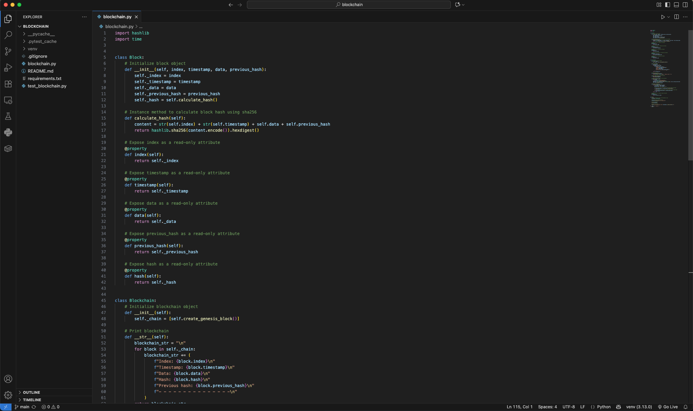

# Blockchain Python




## 🔗 Description
Blockchain Python is a basic implementation of a blockchain using Python. The program demonstrates the core concepts of a blockchain, including blocks, hashing, and chaining, which are essential for building secure and decentralized systems.

## ✨ Features
- Genesis block creation (the first block in the blockchain).
- Ability to add new blocks to the blockchain.
- Validation of the blockchain's integrity.
- SHA-256 hashing to secure each block and ensure immutability.
- Simple and easy-to-understand code for educational purposes.

## 📦 Content
Blockchain Python contains a file called `blockchain.py`, where the blockchain is implemented; `test_blockchain.py`, where the code is tested using `pytest`; `requirements.txt`, which lists the third-party libraries used; and `README.md`, the documentation file.

## 🛠️ Installation
1. Clone the repository to your local machine:

    ```bash
    git clone https://github.com/joherrer/blockchain.git
    ```

2. Navigate to the project directory:

    ```bash
    cd blockchain
    ```

3. Create a virtual environment (optional but recommended):

    ```bash
    python -m venv venv
    ```

4. Activate the virtual environment:

    ```bash
    # Linux/macOS
    source venv/bin/activate
    ```

    ```bash
    # Windows
    venv\Scripts\activate
    ```

5. Install dependencies:

    ```bash
    pip install -r requirements.txt
    ```

## 🖥️ Usage
1. Run the Python script to see how the blockchain works:

    ```bash
    python blockchain.py
    ```

2. The blockchain will be printed, showing the details of each block, including the index, timestamp, data, hash, and previous hash.

3. It will also validate the blockchain to ensure its integrity.

## 📓 Code Explanation

### Block Class
The blocks of the blockchain are built using a class called `Block`.

The `__init__()` method of the object contains the following properties:

- `index`: The index of the block in the chain.
- `timestamp`: The time the block was created.
- `data`: The data stored in the block.
- `previous_hash`: The hash of the previous block, linking it to the current block.
- `hash`: The hash of the current block, generated using SHA-256.

These attributes use the `@property` decorator to make them read-only, adding a layer of security to the `block` object.

The `calculate_hash()` method computes the block's hash generated from the content of the block.

### Blockchain Class
The blockchain is also built using a class called `Blockchain`. 

This class includes the following methods:

1.  `__init__()`: Contains one read-only attribute (chain), which is a tuple containing the blocks of the blockchain, making the chain immutable.

2. `__str__()`: Prints the content of the blockchain.

3. `create_genesis_block()`: Creates the genesis block of the blockchain.

4. `get_latest_block()`: Returns the latest block in the blockchain.

5. `add_block()`: Creates a new block and adds it to the blockchain.

6. `is_chain_valid()`: Verifies the hashes of the current and previous block, returning `True` or `False` depending on whether they are correct.

### Main Flow
The `main()` function demonstrates how the blockchain works by creating a `blockchain` object and adding a new block to it. Then, it prints the blockchain to display its information and validates its integrity.

## 📜 License
Copyright (c) 2025 Jose Herrera. All rights reserved.
